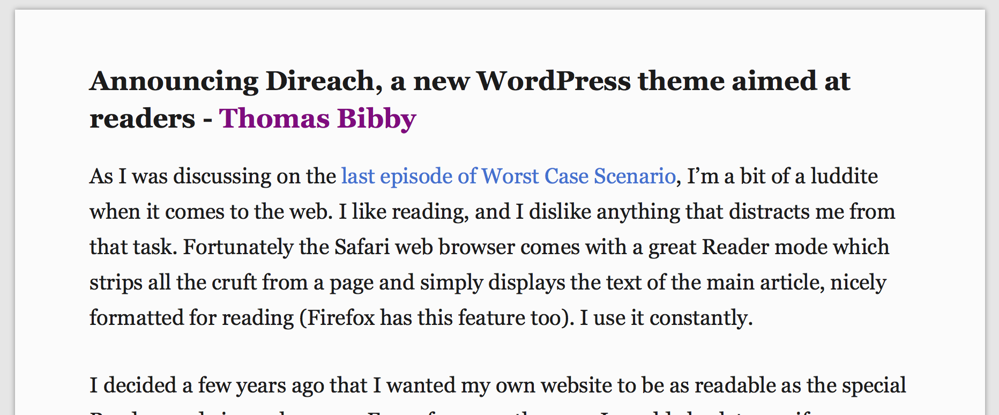

# direach

Direach (from the Irish _díreach_, meaning direct) is a WordPress theme inspired by the 
Reader mode in the Safari web browser.
Blog post: http://thomas.bibby.ie/announcing-direach-a-new-wordpress-theme-aimed-at-readers/
